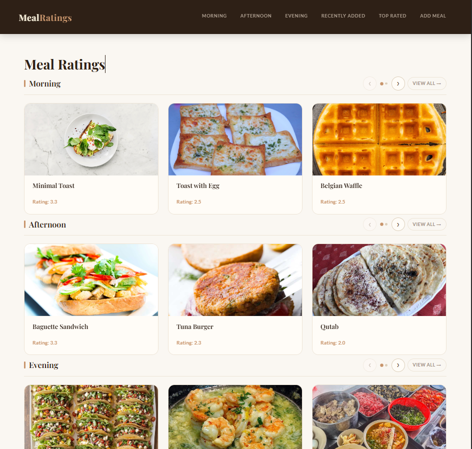
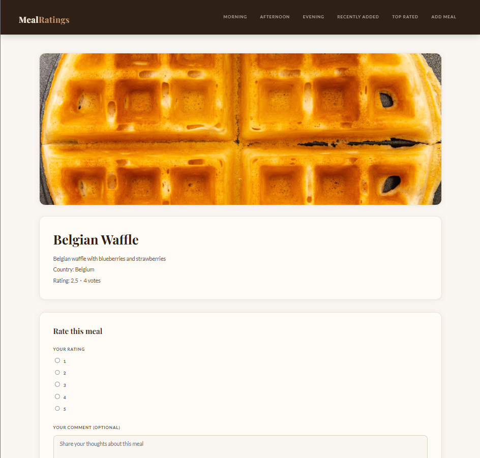

# Meal Ratings Site


## Overview

Django を用いて作成した 食事評価サイト (Meal Rating Site) です。

ユーザーは料理に対して評価（★1〜5）とコメントを投稿でき、
他のユーザーの評価を閲覧することができます。

このプロジェクトでは以下の点を重点的に実装しました。

- Django による Web アプリケーション開発
- モデル設計とリレーション管理
- フォームバリデーション
- View のテスト
- GitHub Actions を用いた CI（自動テスト）

## Screenshot

### Landing Page


### Category List Page


### Meal Detail Page


## Features

主な機能

- 食事の登録
- 食事一覧表示
- 食事詳細ページ
- 食事の評価投稿（★1〜5）
- コメント投稿
- 評価平均値の自動更新
- カテゴリ別表示
    - 朝食
    - 昼食
    - 夕食
- 並び替え
    - 評価順
    - 新着順
    - 国別

## Tech Stack

使用技術
- Python 3.12.7
- Django 6.0.4
- pillow 12.2.0 (画像アップロード用)
- SQLite (開発用データベース)

CI
- GitHub Actions (自動テスト)

## Setup

### Manual Setup

ローカル環境での実行方法

1. リポジトリをクローン
    ```bash
    git clone https://github.com/ShuichiFujii/MealRatingSite.git
    cd MealRatingSite
    ```

2. 仮想環境作成
    ```bash
    python -m venv .venv
    ```

3. 仮想環境起動
    - Windows
        ```bash
        .venv\Scripts\activate
        ```
    - macOS/Linux
        ```bash
        source .venv/bin/activate
        ```

4. 依存関係インストール
    ```bash
    pip install -r requirements.txt
    ```

5. データベースマイグレーション
    ```bash
    python manage.py migrate
    ```

6. 開発サーバー起動
    ```bash
    python manage.py runserver
    ```

---

### Helper Script

Windows 環境では、以下の補助スクリプトを利用できます。

| Script | Description |
|---|---|
| `setup.bat` | 仮想環境作成、依存関係インストール、マイグレーションを実行 |
| `run.bat` | 開発サーバーを起動 |
| `test.bat` | Django のテストを実行 |

## Usage

サーバーを起動後、ブラウザで `http://localhost:8000/` にアクセスしてください。

できること
- 食事の一覧を見る
- 食事の詳細を見る
- 食事を登録する
- 評価とコメントを投稿する
- カテゴリ別に食事を表示する
- 評価順・新着順・国名の辞書順で並び替える

## Tests

テストは Django の `TestCase` を用いて実装しています。

テストの実行方法は以下の通りです。

```bash
python manage.py test
```

テスト対象
- Model
- View
- Form

## CI

GitHub Actions を用いて、プッシュやプルリクエスト時に自動でテストが実行されるように設定しています。

## Design

### Meal と MealRating の分離

食事 (`Meal`) とユーザー評価 (`MealRating`) を別モデルとして設計しました。

`MealRating` は `Meal` に対する ForeignKey を持ち、  
1つの食事に対して複数の評価を投稿できる構造になっています。

### 評価の集計

評価が投稿された後、`update_rating_stats()` を呼び出し  
平均評価 (`average_rating`) と投票数 (`number_of_votes`) を更新しています。

## Future Improvements

今後追加予定の機能
- ユーザー認証機能
- 評価編集 / 削除
- 人気ランキング
- API化

## Author

### GitHub

[Shuichi Fujii](https://github.com/ShuichiFujii)

### Qiita

学習内容や開発中に得た知見を技術記事として投稿しています。

[Qiita - embermaverick05](https://qiita.com/embermaverick05)